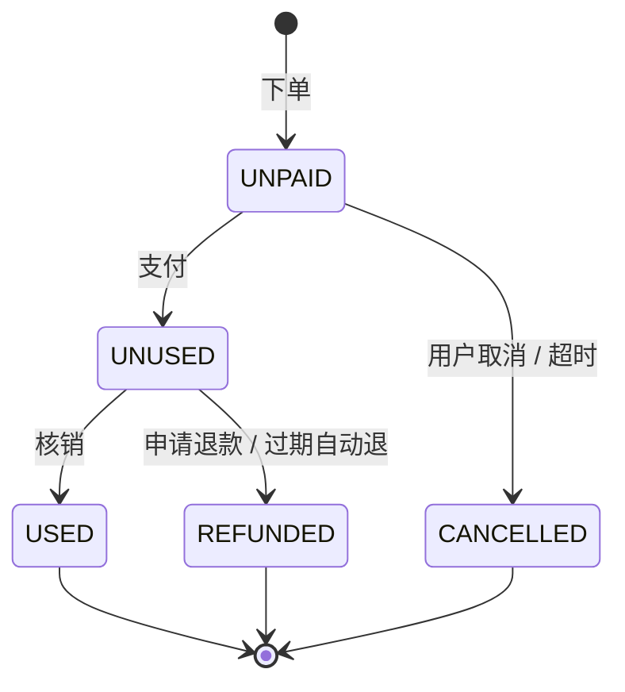
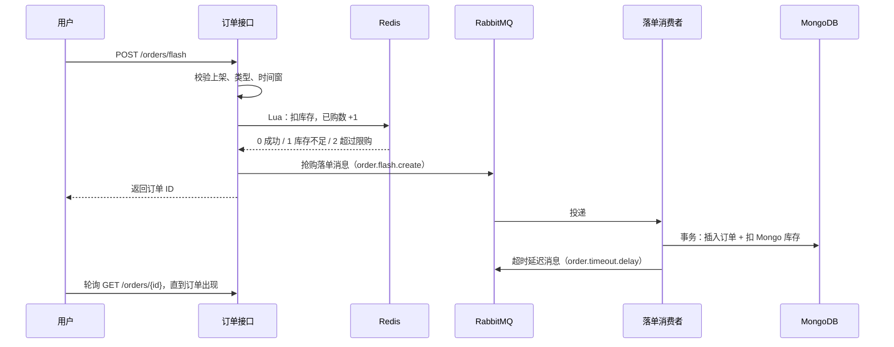

# 抖省省仿制练手 · 需求文档

> v2 · 2026-09-28
>
> 本仓库只有 Java 后端工程（模块化单体）。数据库和中间件都不在本机，由组员另行部署。
>
> 共三份文档，建议按这个顺序读：需求文档 → [接口文档](接口文档.md) → [中间件配置](中间件配置.md)。库结构（集合、索引、ES 索引、MQ 拓扑、Redis key）写在中间件配置里。

## 1. 背景与目标

一群网站爱好者模仿"抖省省"做 Web 网站练手，纯仿制，不上线运营。

抖省省是抖音生活服务 2026-02-10 上线的独立团购 App，功能包括：找低价团购、搜店名比价、分类浏览、收藏、下单后到店核销。种草内容留在抖音主站。公开资料查不到它的技术架构，所以本项目按通用的"团购 + 秒杀"做法来设计。

练手目标：

- 在一条完整的团购业务里用上 MongoDB、Redis、RabbitMQ、Elasticsearch、FastDFS、Nginx、Swagger。
- 为以后部署到阿里云 + K8s 做好准备：所有配置都能用环境变量覆盖。

| 项 | 选型 |
|---|---|
| 后端 | Spring Boot 3.5.16，JDK 21，Maven 多模块（模块化单体） |
| 数据库 | MongoDB 8.0（必须是副本集，练手用单节点即可，用于支持事务） |
| 缓存 | Redis 7.4 |
| 消息 | RabbitMQ 4.3 |
| 搜索 | Elasticsearch 8.19 + IK 中文分词 |
| 文件 | FastDFS 6.18 |
| 网关 | Nginx |
| 接口文档 | springdoc-openapi 2.8（Swagger UI） |
| 前端 | Vue 3 + Element Plus（前端工程不在本仓库） |
| 部署 | 阿里云 + K8s（本期不做） |

## 2. 范围

### 2.1 本期做

**用户端（C 端，PC 网页）**

- 账号：手机号 + 验证码登录（新手机号自动注册）、个人资料
- 浏览：分类浏览、店铺详情、商品详情、首页商品流、抢购专区、搜索商品和店铺
- 交易：普通下单、抢购下单、模拟支付、取消、退款、订单列表与详情（含券码）
- 收藏：收藏店铺和商品

**内部接口（无界面）**

- 组员通过 Swagger 调用：录入店铺和商品、上下架、按券码模拟核销、上传图片。
- 本期只做用户端，又不往库里填任何数据，所以所有店铺和商品都靠这组接口录入。

### 2.2 本期不做

- 交易相关：购物车、优惠券 / 红包 / 补贴、评价
- 内容相关：短视频 / 直播内容
- 位置相关：附近、定位、按距离排序（店铺不存经纬度）
- 其他端：商家端、平台后台
- 外部服务：真实短信、真实支付、消息通知
- 终端适配：手机布局 / H5 适配
- 部署：阿里云 + K8s 的部署清单

### 2.3 工程范围

- 本机只有 Java 的 IDEA 工程，以及三份文档：需求文档、接口文档、中间件配置。
- 数据库和中间件都不在本机，由组员另行部署；后端对它们的要求见中间件配置。
- 前端工程不在本仓库，按接口文档对接。

## 3. 角色

| 角色 | 身份 | 可用接口 |
|---|---|---|
| 游客 | 未登录 | 公开接口：分类、店铺、商品、搜索、发验证码、登录 |
| 登录用户 | 请求头带 `Authorization: Bearer <token>` | 公开接口 + 个人资料、上传头像、订单全流程、收藏 |
| 组员 | 请求头带 `X-Internal-Key`，通过 Swagger 调用 | 内部接口：录入店铺和商品、上下架、核销、上传图片 |

## 4. 术语

| 术语 | 含义 |
|---|---|
| 商品 | 店铺上架的一个团购套餐或服务，分普通（NORMAL）和抢购（FLASH）两种 |
| 套餐内容 | 商品包含的东西，按分组列出，如"主食：牛肉面 ×1"。就是最初设计里的"菜品" |
| 抢购 | 限量、限时、每人限购的商品 |
| 券码 | 支付成功后生成的 12 位数字，到店出示给商家核销 |
| 核销 | 确认券码已经使用。本期用内部接口模拟 |
| 快照 | 下单时复制进订单的商品名、商品图、金额、店铺名。商品之后再改，也不影响旧订单 |
| 有效期 | 券在支付后 validDays 天内可用，到期没用会自动退款 |
| fileId | FastDFS 返回的文件标识，如 `group1/M00/00/00/xxx.jpg`。库里只存它 |

## 5. 用户原始设计与修订

**用户**

- 原始设计：手机号、验证码、登录状态、账户名、头像
- 修订后：id、phone、nickname（即账户名）、avatar(fileId)、status、createTime、updateTime
- 原因：验证码和登录态都是临时数据，放 Redis，不进用户表

**店铺**

- 原始设计：店铺 ID、名字、地址、展示图
- 修订后：补分类、营业时间、电话；展示图改为多张；不加经纬度
- 原因：分类浏览和店铺详情需要这些字段；本期不做"附近"

**商品**

- 原始设计：商品 ID(long)、名字、菜品、店铺 ID、价格、类型（普通/抢购）、数量（仅抢购）、展示图
- 修订后：
  - 菜品改为对象数组，改名"套餐内容"
  - 只保留一个金额 price
  - 补上下架、已售数、有效期、使用规则
  - 抢购商品补开抢时间、结束时间、每人限购
- 原因：
  - 嵌套数组在 Java 和 Mongo 里没法映射成类；对象数组也能用于非餐饮套餐
  - 抢购需要时间窗和限购

**订单**

- 原始设计：订单 ID、状态（待支付/已支付/待使用/已取消/已使用）、商品价格、创建时间
- 修订后：
  - 补用户 ID、商品 ID、店铺 ID、商品快照、券码
  - 补支付、核销、取消、退款的时间与原因
  - "已支付"并入"待使用"，新增"已退款"
- 原因：
  - 付完款就出券码，"已支付"和"待使用"是同一时刻
  - 团购普遍支持随时退和过期自动退

## 6. 功能需求

每条需求都列出规则、异常情况和对应的接口。业务码见 [接口文档 §3](接口文档.md#3-业务码)。

### 6.1 登录与用户（dss-user）

**U-01 发送验证码** · `POST /api/v1/auth/sms-code`

- 手机号必须匹配 `^1[3-9]\d{9}$`，否则返回 400 / 40000。
- 生成 6 位数字验证码，写入 Redis，有效期 5 分钟。
- 同一手机号 60 秒内不能重发，否则返回 101001。
- 重发会覆盖旧验证码，同时把该手机号的校验失败次数清零。
- 不接真短信，验证码写在 INFO 日志里。**这只用于练手**，真要上线运营，必须先换成真实短信。

**U-02 登录 / 自动注册** · `POST /api/v1/auth/login`

- 验证码错误或已过期，返回 101002。同一个验证码累计错 5 次就作废，返回 101003，需要重新获取。
- 验证通过后立即删除验证码，保证只能用一次。
- 手机号没注册过就自动注册：昵称为"用户"+手机号后 4 位，头像为空（前端显示默认头像），状态为 NORMAL。
- DISABLED 用户不能登录，返回 101004。
- 生成一个随机 UUID 作为 token，把登录态（userId、nickname、avatar）存进 Redis，有效期 7 天，然后返回 token 和用户资料。
- 允许多处同时登录，每次登录都生成一个新 token。

**U-03 登录态**

- 需要登录的接口必须带请求头 `Authorization: Bearer <token>`。
- 每次访问都把有效期续满 7 天（滑动过期）。
- token 缺失、格式不对或已过期，返回 401 / 40100。

**U-04 登出** · `POST /api/v1/auth/logout`

删除当前 token 的登录态。同一用户在其他设备上的 token 不受影响。

**U-05 查看资料** · `GET /api/v1/users/me`

返回当前用户的资料。如果用户已被删除，返回 101005。

**U-06 修改资料** · `PUT /api/v1/users/me`

- 昵称 1–20 个字；头像传上传接口返回的 fileId。
- 传哪个字段就改哪个；一个都不传就不改。
- 修改后同步更新 Redis 登录态里的昵称和头像。

### 6.2 店铺与分类（dss-shop）

**S-01 分类列表** · `GET /api/v1/categories`

分类是代码里的枚举，不建集合，也不入库。取值：

| 编码 | 名称 |
|---|---|
| FOOD | 餐饮美食 |
| DESSERT_DRINK | 甜点饮品 |
| SNACK | 快餐小吃 |
| SUPERMARKET | 商超购物 |
| LEISURE | 休闲娱乐 |
| STAY | 住宿游玩 |

**S-02 店铺详情** · `GET /api/v1/shops/{shopId}`

公开接口。店铺不存在时返回 102001。

**S-03 按分类浏览店铺**

走店铺搜索：关键词留空、只传分类。见 6.5。

**S-04 新建 / 修改店铺（内部）** · `POST /api/v1/internal/shops`、`PUT /api/v1/internal/shops/{shopId}`

- 字段要求：
  - 名称：必填，最多 50 字
  - 地址：必填，最多 200 字
  - 分类：必填
  - 展示图：1–9 张（fileId）
  - 营业时间：选填，最多 50 字，如 `10:00-22:00`
  - 电话：选填
- 修改是整体覆盖（PUT）。
- 成功后发 `shop.upsert` 搜索同步事件。

### 6.3 商品（dss-product）

**P-01 商品类型**

- NORMAL 普通：不限量，不维护库存。
- FLASH 抢购：限量、限时、每人限购。

**P-02 新建商品（内部）** · `POST /api/v1/internal/products`

- 所有商品的必填项：
  - 所属店铺：必须存在，否则返回 102001
  - 名称：最多 60 字
  - 套餐内容：可以是空数组
  - 金额：单位分，至少 1
  - 类型
  - 展示图：fileId
  - 有效期天数：1–365
  - 使用规则：可以是空数组
- 抢购商品另外要填：
  - 库存：至少 1
  - 开抢时间、结束时间
  - 每人限购：至少 1，不传默认为 1
- 抢购参数出错时：
  - 缺库存或缺时间，返回 103005
  - 结束时间不晚于开抢时间，返回 103006
- 新建后直接上架（ON_SHELF），已售数为 0。
- 抢购商品：把库存写入 Redis `dss:flash:stock:{id}`，并删除该商品的已购计数 `dss:flash:bought:{id}`。
- 成功后发 `product.upsert` 搜索同步事件。

**P-03 修改商品（内部）** · `PUT /api/v1/internal/products/{productId}`

- 整体覆盖。
- 不能改的字段：
  - 商品类型，改了返回 103003
  - 所属店铺，改了返回 103004
- 抢购开始后（当前时间 ≥ 开抢时间），不能再改库存、限购和时间窗，否则返回 103007。开抢前改库存，要同时重写 Redis 里的库存。
- 成功后发 `product.upsert`。

**P-04 上下架（内部）** · `PUT /api/v1/internal/products/{productId}/status`

- 下架后，C 端看不到这个商品，也不能下单；已经下的单不受影响。
- 成功后发 `product.upsert`。

**P-05 商品详情** · `GET /api/v1/products/{productId}`

- 商品不存在，返回 103001；已下架，返回 103002。
- 返回内容包括店铺名称和地址。
- 抢购商品另外返回剩余库存（以 Redis 为准）、开抢时间、结束时间和每人限购。

**P-06 店铺的上架商品** · `GET /api/v1/shops/{shopId}/products`

只返回上架商品，按创建时间倒序，一次返回全部（一家店的商品不多，不分页）。

**P-07 首页商品流** · `GET /api/v1/products`

- 只返回上架商品，分页。
- `sort=latest`（默认）按创建时间倒序；`sort=sales` 按已售数倒序。

**P-08 抢购专区** · `GET /api/v1/products/flash`

- 返回上架且还没结束的抢购商品（进行中和即将开始的），按开抢时间升序。
- 每项都标出是否正在进行，以及剩余库存。

**P-09 已售数**

- 支付成功 +1，退款 −1；取消待支付订单不影响已售数。
- 每次变化都发 `product.upsert`，让搜索里的销量排序跟上。

### 6.4 订单（dss-order）

一个订单只含一件商品，对应一张券；买两份就下两单。状态机见第 7 节。

所有状态迁移都用"带原状态条件的原子更新"，所以并发操作和重复消息都是幂等的。

**O-01 普通商品下单** · `POST /api/v1/orders`

- 校验：
  - 商品存在，否则返回 103001
  - 已上架，否则返回 103002
  - 类型为 NORMAL；抢购商品要走 O-02，否则返回 103013
- 同步创建 UNPAID 订单：
  - 写入快照：商品名、商品图、金额、店铺名
  - amount = 商品金额
  - payDeadline = 创建时间 + 15 分钟
- 投递超时延迟消息（15 分钟后到期）。
- 返回订单 ID。

**O-02 抢购下单** · `POST /api/v1/orders/flash`

1. 校验商品：
   - 存在，否则返回 103001
   - 已上架，否则返回 103002
   - 类型为 FLASH，否则返回 103012
   - 当前在时间窗内：未开始返回 103008，已结束返回 103009
2. 执行 Lua 脚本，原子地扣减 Redis 库存、累加该用户的已购数。库存不足返回 103010，超过限购返回 103011。
3. 成功后生成订单 ID，投递"抢购落单"消息，立即返回订单 ID。这时订单可能还没写进数据库。
4. 消费者在一个 Mongo 事务里插入 UNPAID 订单（写快照）、扣减 Mongo 库存，然后投递超时延迟消息。订单 ID 就是 `_id`，重复消息会因主键冲突被忽略，所以是幂等的。
5. 前端拿到订单 ID 后轮询订单详情。订单写入前，详情接口返回 104001；建议每秒查一次，最多查 10 次。
6. 消费者重试 3 次仍失败的消息，进死信队列 `order.flash.create.dlq`，由组员人工处理（回补 Redis 库存和已购数）。

**O-03 模拟支付** · `POST /api/v1/orders/{orderId}/pay`

- 校验：
  - 只能付自己的订单；不是本人的订单按"不存在"处理，返回 104001
  - 状态必须是 UNPAID，否则返回 104002
  - 必须在 payDeadline 之前，否则返回 104003
- 调用 PayService。本期只有 MOCK 实现，调用即成功。
- 订单从 UNPAID 变为 UNUSED：
  - 生成唯一的 12 位数字券码
  - 写入 payChannel=MOCK、payTime、expireTime（= payTime + validDays 天）
  - 商品已售数 +1
- 返回订单详情（含券码）。

**O-04 取消待支付订单** · `POST /api/v1/orders/{orderId}/cancel`

- 只能取消自己的 UNPAID 订单：不是本人的返回 104001，状态不对返回 104002。
- 订单从 UNPAID 变为 CANCELLED，cancelReason = USER。
- 如果是抢购订单，回补 Mongo 库存、Redis 库存和该用户的已购数。

**O-05 超时取消**

- 超时延迟消息 15 分钟后到期。如果订单仍是 UNPAID，就把它改为 CANCELLED，cancelReason = TIMEOUT；抢购订单按 O-04 回补。已经不是 UNPAID 的订单直接忽略。
- 兜底任务每 5 分钟扫一次，把已过 payDeadline 仍是 UNPAID 的订单同样按超时取消，防止延迟消息丢失。

**O-06 申请退款** · `POST /api/v1/orders/{orderId}/refund`

- 只能退自己的 UNUSED 订单：不是本人的返回 104001，状态不对返回 104002。在 UNUSED 状态下随时可以退。
- 退款即时成功（模拟）：订单从 UNUSED 变为 REFUNDED，refundReason = USER，商品已售数 −1。
- 抢购商品退款不回补库存，也不减少已购数。

**O-07 过期自动退款**

定时任务每 10 分钟扫一次，找出 expireTime 已过、仍是 UNUSED 的订单，改为 REFUNDED，refundReason = EXPIRED，已售数 −1。

**O-08 核销（内部）** · `POST /api/v1/internal/vouchers/{voucherCode}/redeem`

- 券码不存在，返回 104004。
- 订单不是 UNUSED，返回 104006。
- 券已过期（已过 expireTime），返回 104005。
- 核销成功后，订单从 UNUSED 变为 USED，记录 useTime。

**O-09 我的订单** · `GET /api/v1/orders`

可按状态筛选，按创建时间倒序，分页。

**O-10 订单详情** · `GET /api/v1/orders/{orderId}`

- 只能看自己的订单。不是本人的订单，以及抢购单还没写入时，都返回 104001。
- 状态为 UNUSED 或 USED 时返回券码，其他状态券码为 null。

**O-11 定时任务**

- 多副本部署时，同一个任务同一时刻只在一个副本上跑（用 Redis 锁 `dss:lock:job:{jobName}`）。
- 每条订单的迁移本身也是条件更新，所以重复处理也不会出错。
- 骨架期定时任务默认关闭（`dss.job.enabled=false`），等实现后再打开。

### 6.5 搜索（dss-search）

**Q-01 商品搜索** · `GET /api/v1/search/products`

- 关键词：匹配商品名、套餐内容、店铺名（IK 分词），可以不传。
- 筛选：可按分类（取所属店铺的分类）、商品类型筛选。
- 排序 `sort`：
  - `default`：综合，先按相关度，再按已售数；不传关键词时等同于按已售数倒序
  - `sales`：已售数倒序
  - `price_asc`：价格升序
  - `price_desc`：价格降序
- 只返回上架商品，分页。
- ES 不可用时返回 107001。

**Q-02 店铺搜索** · `GET /api/v1/search/shops`

- 关键词匹配店名、地址，可按分类筛选，分页。
- 不传关键词时就是按分类浏览，按创建时间倒序。
- ES 不可用时返回 107001。

**Q-03 数据同步**

- 店铺或商品新增、修改、上下架、已售数变化时，业务模块发 MQ 事件（`shop.upsert` 或 `product.upsert`），消息里只带 docType 和 id。
- 搜索模块收到后，从 Mongo 读最新数据，整条覆盖写入 ES。
- 店铺改名或改分类时，同时更新这家店所有商品文档里的店铺名和分类。
- 消费重试 3 次仍失败的消息进 `search.sync.dlq`。

### 6.6 收藏（dss-favorite）

**F-01 收藏** · `POST /api/v1/favorites`

- 目标类型是 SHOP 或 PRODUCT。
- 目标必须存在，否则返回 105001。下架的商品也可以收藏。
- 同一个目标只能收藏一次，重复收藏返回 105002。

**F-02 取消收藏** · `DELETE /api/v1/favorites/{targetType}/{targetId}`

没收藏过也返回成功（幂等）。

**F-03 收藏列表** · `GET /api/v1/favorites`

- 按类型分页，按收藏时间倒序。
- 每项带目标的名称和图片，商品另带金额。
- 商品已下架也照常显示，并标明已下架。

**F-04 是否已收藏** · `GET /api/v1/favorites/status`

店铺详情页、商品详情页用它来决定收藏按钮的状态。

### 6.7 文件（dss-file）

**FILE-01 上传图片**

- 两个入口：
  - `POST /api/v1/files/images`：登录用户用，上传头像
  - `POST /api/v1/internal/files/images`：内部用，上传店铺图和商品图
- 请求格式为 `multipart/form-data`，字段名是 `file`。
- 校验：
  - 空文件，返回 106001
  - 只接受 jpg/png/webp（按 Content-Type 判断，可在 `dss.file.allowed-types` 配置），否则返回 106002
  - 单个文件超过 5MB（可在 `dss.file.max-size` 配置），返回 106003
  - 存储失败，返回 106004
  - 整个请求超过 10MB 时会先被框架拦截，返回 400 / 40000
- 返回 fileId 和完整 URL；URL 的基础地址可在 `dss.file.base-url` 配置。
- 存储层由 FileStorageService 抽象。目前是 FastDFS 实现，以后换成 MinIO 或 OSS 不用改业务代码。

### 6.8 内部接口

- 一共 7 个：新建店铺、修改店铺、新建商品、修改商品、上下架、核销、上传图片。
- 所有环境都注册这组接口，调用时必须带请求头 `X-Internal-Key`。
  - 口令的值来自配置 `dss.internal.key`，生产环境由 K8s Secret 注入。
  - 没配置口令时一律拒绝，返回 403 / 40300。
- 这组接口不认用户 token。
- 经 Nginx 对外访问时，这组路径一律 deny，只能直连后端（本地就是直接访问 8080）。
- 在 Swagger UI 里单独分成"内部接口"一组，点 Authorize 填口令即可调用。

## 7. 订单状态机

| 状态 | 中文 | 说明 |
|---|---|---|
| UNPAID | 待支付 | 已下单、未支付，15 分钟内有效 |
| UNUSED | 待使用 | 已支付，有券码；原来的"已支付"并入这个状态 |
| USED | 已使用 | 已核销，终态 |
| CANCELLED | 已取消 | 用户取消或超时未付，终态 |
| REFUNDED | 已退款 | 用户申请退款或过期自动退，终态 |

**UNPAID → UNUSED**

- 触发：用户支付
- 前置条件：本人的订单，且没过 payDeadline
- 同时发生：生成券码；写入 payChannel、payTime、expireTime；已售数 +1

**UNPAID → CANCELLED**

- 触发：用户取消（USER）或超时（TIMEOUT）
- 前置条件：订单仍是 UNPAID
- 同时发生：抢购订单回补 Mongo 库存、Redis 库存和已购数

**UNUSED → USED**

- 触发：内部核销
- 前置条件：没过 expireTime
- 同时发生：写入 useTime

**UNUSED → REFUNDED**

- 触发：用户退款（USER）或过期（EXPIRED）
- 前置条件：订单仍是 UNUSED
- 同时发生：已售数 −1；抢购订单不回补库存和已购数

## 8. 关键流程

### 8.1 抢购下单

### 8.2 超时取消

1. 下单成功后，往 `order.timeout.delay` 队列投一条消息。这个队列的 TTL 是 15 分钟，而且没有消费者。
2. 消息到期后，经死信转到 `order.timeout` 队列，由超时消费者处理（见 O-05）。
3. 另外有兜底任务每 5 分钟扫一次，防止延迟消息丢失。

### 8.3 搜索同步

店铺或商品写库成功 → 发 `shop.upsert` / `product.upsert` → 进入 `search.sync` 队列 → 搜索模块从 Mongo 读最新数据 → 写入 ES。

## 9. 页面清单（PC 网页，前端另建）

**首页**

- 内容：分类入口、抢购专区、商品流
- 接口：categories、products/flash、products

**搜索结果页**

- 内容：分商品、店铺两个 Tab，可按分类和排序筛选；从分类入口进来也是这一页
- 接口：search/products、search/shops、categories

**店铺详情**

- 内容：店铺信息、店内商品、收藏按钮
- 接口：shops/{id}、shops/{id}/products、favorites/status、favorites

**商品详情**

- 内容：套餐内容、金额、有效期、使用规则、抢购信息、收藏按钮、购买按钮
- 接口：products/{id}、favorites/status、favorites

**下单与支付页**

- 内容：确认商品、提交订单（抢购单要轮询到订单写入）、模拟支付
- 接口：orders、orders/flash、orders/{id}、orders/{id}/pay

**订单列表**

- 内容：按状态筛选订单
- 接口：orders

**订单详情**

- 内容：券码、状态、时间线、取消和退款按钮
- 接口：orders/{id}、orders/{id}/cancel、orders/{id}/refund

**我的收藏**

- 内容：分店铺、商品两个 Tab
- 接口：favorites、favorites/{type}/{id}

**个人中心**

- 内容：编辑资料、换头像、登出
- 接口：users/me、files/images、auth/logout

**登录弹窗（全局）**

- 内容：手机号 + 验证码登录
- 接口：auth/sms-code、auth/login

前端约定（给前端工程参考）：

- Vite 开发端口用 5190，因为本机的 5173、4185 已被占用。
- `/api` 代理到后端 8080。
- 收到 401 时弹出登录弹窗。

## 10. 非功能需求

- **并发与一致性**：抢购不能超卖、不能超出限购，靠 Redis Lua 原子扣减加 Mongo 事务保证。订单状态迁移靠条件更新保证幂等。
- **时区**：统一用 Asia/Shanghai。
  - JVM 启动参数加 `-Duser.timezone=Asia/Shanghai`（启动类里也设了默认时区）。
  - 容器设 `TZ=Asia/Shanghai`，Jackson 用 `GMT+8`。
  - 时间格式统一为 `yyyy-MM-dd HH:mm:ss`。
- **配置与口令**：所有地址和口令都能用环境变量覆盖，方便以后用 K8s ConfigMap / Secret 注入。仓库里不放真实口令，变量清单见中间件配置第 2 节。
- **对外暴露面**：经 Nginx 对外只暴露 C 端接口。Swagger UI 和内部接口只能直连后端访问。
- **接口文档**：Swagger UI 地址是 `/swagger-ui.html`，分"C 端接口"和"内部接口"两组，开关可配置。
- **安全底线（练手级）**：验证码打日志、模拟支付都只用于练手；内部口令用恒定时间比较，防止时序攻击。
- **浏览器**：PC 端最新版 Chrome / Edge，不做手机布局。

## 11. 数据约定

- **ID**：一律 long，由 Redis 生成（见中间件配置 5.4）。JSON 里一律用字符串，因为 18–19 位的数超出了 JS 能精确表示的范围。
- **金额**：以"分"为单位的整数，JSON 输出数字。只有一个金额，不分原价和团购价。
- **时间**：`yyyy-MM-dd HH:mm:ss`，东八区。
- **枚举**：英文大写字符串；排序参数用小写代码，如 `latest`、`price_asc`。
- **图片**：库里只存 fileId，接口返回时带上完整 URL。

## 12. 待定事项

| 事项 | 什么时候定 |
|---|---|
| 阿里云部署方式：用 ACK 还是在 ECS 上自建 K8s；需要几台机器、多大内存 | 部署阶段 |
| FastDFS Java 客户端选型：tobato 停在 2020 年；官方客户端没发到 Maven Central | 实现文件上传时 |
| FastDFS 的"容器 IP 问题"用哪种解法（见中间件配置 8.4） | 部署 FastDFS 时 |
| 真实短信、支付宝沙箱 | 需要时再加 |
| 前端工程 | 另建，不在本仓库 |
